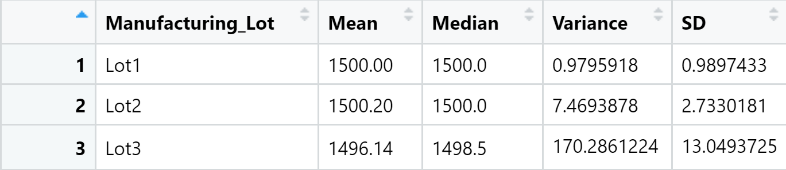
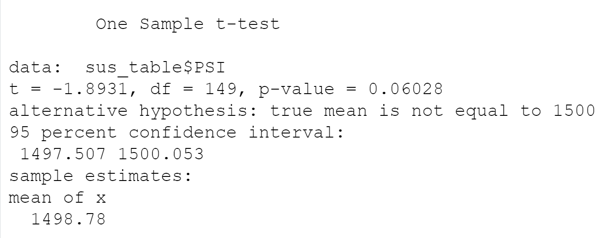
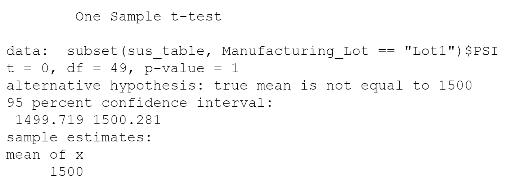
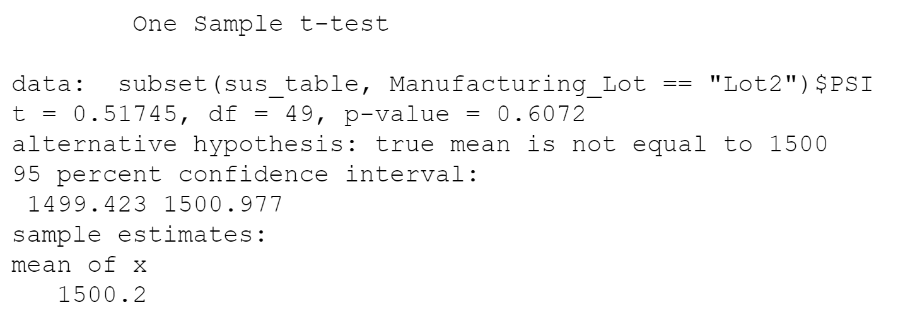
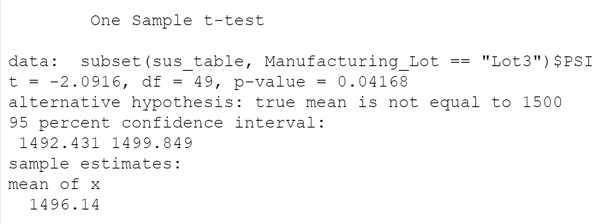

# MechaCar Statistical Analysis
## Project Overview
The current project was conducted for the client AutosRUs, whose newest prototype (the MechaCar) is suffering from production troubles. The purpose of these analyses was to provide insights to help the manufacturing team. In addition, a statistical study was designed to compare the MechaCar performance to that of competing vehicles from other manufacturers. 

### Resources
- Data: [MechaCar_mpg.csv](Resources/MechaCar_mpg.csv) and [Suspension_Coil.csv](Resources/Suspension_Coil.csv)
- Software: R, RStudio

## Linear Regression to Predict MPG
First, a multiple regression model was created and evaluated to determine how certain variables contributed to the MPG values. The results are below:  

**mpg = (6.267)vehicle_length + (0.0012)vehicle_weight + (0.0688)spoiler_angle + (3.546)ground_clearance + (-3.411)AWD - 104.0**  

According to the results, **vehicle length** and **vehicle ground clearance** provide a non-random amount of vairance to the MPG values. In other words, these two variables are likely to have a significant impact on the MPG of the MechaCar. Because the p-value of the model is lower than 0.05, we can **reject the null hypothesis** that states that the slope is zero. The evidence supports the alternative hypothesis that the slope is not zero. Based on the r-squared value of 0.7149, the model explains about 71% of the variance in MPG. Therefore, we can conclude that this model effectively predicts the MPG of the MechaCar prototypes.  

## Summary Statistics on Suspension Coils
The design specifications for the MechaCar state that the variance of the suspension coils must not exceed 100 pounds per square inch. Summary statistics were calculated for all of the manufacturing lots together and it was revealed that the variance of the suspension coils is 62.69. Therefore, it does not exceed the specifications.    

When we dive deeper and calculate summary statistics for each manufacturing lot separately, Lot 1 and Lot 2 have variances that are far below the design specification. However, the variance of Lot 3 greatly exceeds the design specification. The variance of Lot 3 is causing the variance of the combined lots to be increased.   
  

## T-Tests on Suspension Coils
A t-test was conducted to determine if the PSI across all of the manufacturing lots is statistically different from the population mean of 1,500 pounds per square inch. The sample mean was 1,498.78 and the p-value was 0.06. This indicates that the PSI across the manufacturing lots is statistically similar to the population mean, and we fail to reject the null hypothesis.   
   

After the initial t-test, 3 more were conducted on each manufacturing lot separately. The results of these tests are below. 

### Lot 1
The mean of this lot was 1500 and the p-value was 1. This indicates that there is no statistically significant difference from the population mean and we fail to reject the null hypothesis.  
  

### Lot 2
The mean of this lot was 1500.2 and the p-value was 0.61. This indicates that there is no statistically significant difference from the populaltion mean and we fail to reject the null hypothesis.   
 

### Lot 3
The mean of this lot was 1496.14 adn the p-value was 0.04. In contrast to the previous two lots, this indicates that there *is* a statistically significant difference from the population mean, and we reject the null hypotheis.  
 

## Study Design: MechaCar vs Competition
