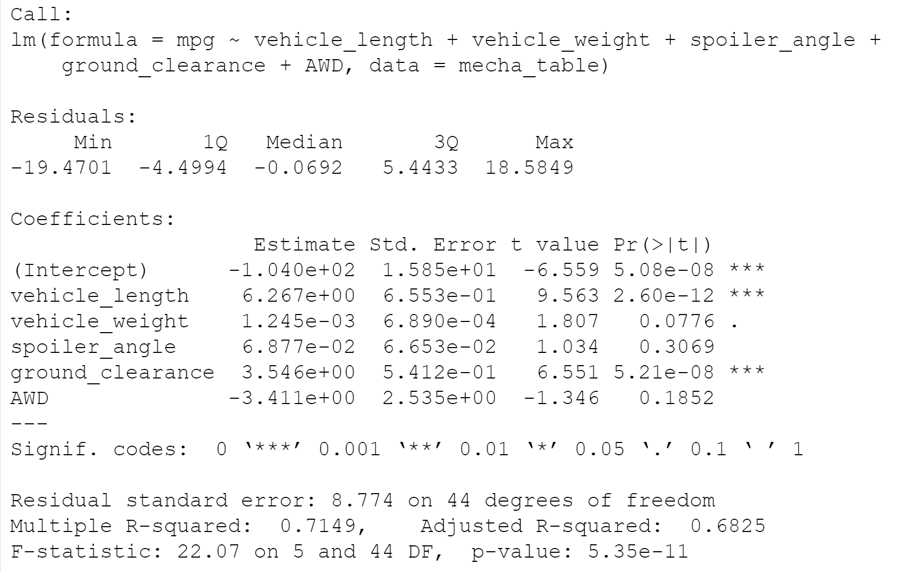

# MechaCar Statistical Analysis
## Project Overview
The current project was conducted for the client AutosRUs, whose newest prototype (the MechaCar) is suffering from production troubles. The purpose of these analyses was to provide insights to help the manufacturing team. In addition, a statistical study was designed to compare the MechaCar performance to that of competing vehicles from other manufacturers. 

### Resources
- Data: [MechaCar_mpg.csv](Resources/MechaCar_mpg.csv) and [Suspension_Coil.csv](Resources/Suspension_Coil.csv)
- Software: R, RStudio

## Linear Regression to Predict MPG
First, a multiple regression model was created and evaluated to determine how certain variables contributed to the MPG values. The results are below:  

**mpg = (6.267)vehicle_length + (0.0012)vehicle_weight + (0.0688)spoiler_angle + (3.546)ground_clearance + (-3.411)AWD - 104.0**  

  

According to the results, **vehicle length** and **vehicle ground clearance** provide a non-random amount of vairance to the MPG values. In other words, these two variables are likely to have a significant impact on the MPG of the MechaCar. Because the p-value of the model is lower than 0.05, we can **reject the null hypothesis** that states that the slope is zero. The evidence supports the alternative hypothesis that the slope is not zero. Based on the r-squared value of 0.7149, the model explains about 71% of the variance in MPG. Therefore, we can conclude that this model effectively predicts the MPG of the MechaCar prototypes.  

## Summary Statistics on Suspension Coils

## T-Tests on Suspension Coils

## Study Design: MechaCar vs Competition
